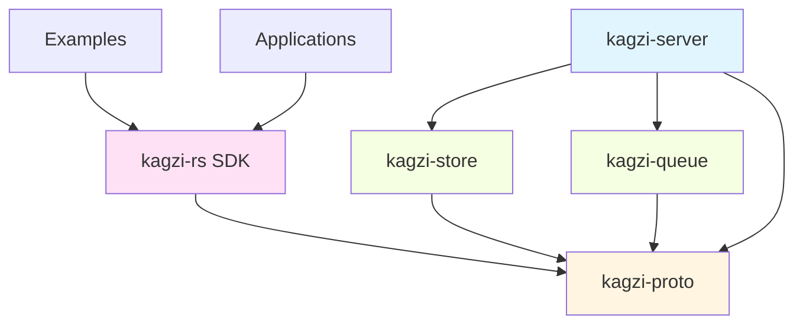
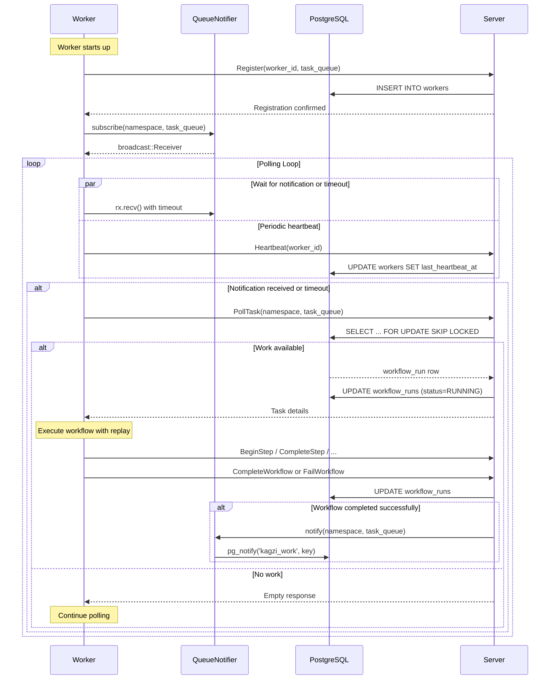
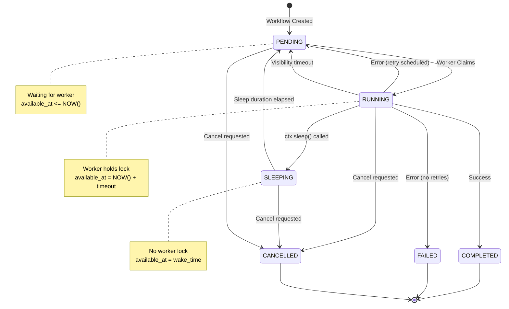
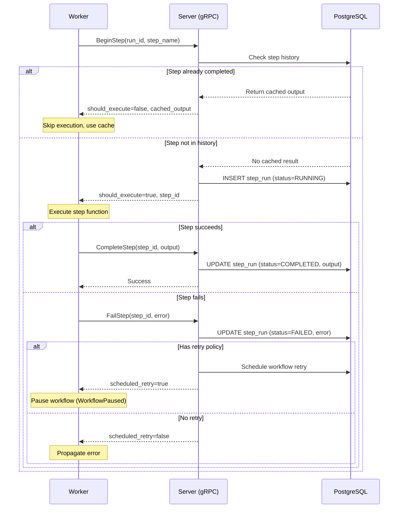

# Kagzi Architecture

## 1. Introduction & Core Concepts

### 1.1. What is Kagzi?

Kagzi is a workflow orchestration engine that provides reliable, durable workflow execution. It enables developers to write workflows that survive process crashes, server restarts, and code deploys. Workers execute workflows deterministically, replaying from checkpoints when recovery is needed.

Kagzi draws inspiration from systems like Temporal and AWS Step Functions but prioritizes operational simplicity. It uses a worker-driven architecture where a PostgreSQL database serves as the single source of truth for all workflow state, eliminating the need for separate orchestrator services.

### 1.2. Core Concepts

- **Workflow**: A durable function orchestrating multiple steps. Workflows are deterministic, resumable, and survive infrastructure failures.

- **Workflow Run**: A single execution instance of a workflow, from start to finish. Each run is a state machine managed by workers through database state.

- **Step**: A durable checkpoint within a workflow representing a unit of work. Steps are memoized so completed steps don't re-execute during replay.

- **Step Run**: A record representing the state and result of a single step execution within a workflow run.

- **Worker**: A long-running process that polls the database for pending workflows, executes their code, and persists results.

- **Client**: The SDK component used by application code to start and query workflow runs.

- **Backend**: PostgreSQL serves as the persistence layer, storing workflow state and acting as the coordination queue.

- **availableAt**: A critical timestamp controlling when a workflow becomes visible to workers. Used for scheduling, visibility timeouts, retries, and durable timers.

### 1.3. Workflow Run Statuses

A workflow run progresses through these states:

- **pending**: The workflow has been created and waits for a worker to claim it.

- **running**: A worker has claimed the workflow and is actively executing it.

- **sleeping**: The workflow is paused waiting for a duration to elapse (via `step.sleep`). The `availableAt` timestamp controls when it becomes available again.

- **completed**: The workflow finished successfully.

- **failed**: The workflow failed and all retries have been exhausted.

- **cancelled**: The workflow was explicitly cancelled and will not be processed further.

- **scheduled**: A schedule template that fires workflows at cron intervals.

- **paused**: A disabled schedule template that won't fire until resumed.

### 1.4. Step Run Statuses

A step run can be in one of these states:

- **pending**: The step has been defined but not yet executed.

- **running**: A worker is currently executing the step function.

- **completed**: The step executed successfully and its result is stored for replay.

- **failed**: The step threw an error. The workflow may retry if configured.

## 2. System Architecture

### 2.1. Architecture Overview

Kagzi follows a worker-driven architecture where PostgreSQL is the central coordination point. There is no separate orchestrator server.

```
┌─────────────────────────────────────────────────────────────────────────┐
│                         Kagzi System Architecture                        │
└─────────────────────────────────────────────────────────────────────────┘

  ┌──────────────────┐              ┌──────────────────┐
  │  Application     │              │  Kagzi Server    │
  │  (Client SDK)    │──── gRPC ───▶│  (kagzi-server)  │
  └──────────────────┘              └──────────────────┘
         │                                   │
         │                                   │
         │          ┌────────────────────────┴────────────┐
         │          │                                     │
         │          ▼                                     ▼
         │    ┌──────────┐                      ┌─────────────────┐
         │    │  gRPC    │                      │  Coordinator    │
         │    │ Services │                      │  (Background)   │
         │    └──────────┘                      └─────────────────┘
         │          │                                     │
         │          │                                     │
         └──────────┴─────────────────────────────────────┘
                    │
                    ▼
         ┌─────────────────────────────────────────────┐
         │         PostgreSQL Database                 │
         │  ┌─────────────────────────────────────┐   │
         │  │  Tables:                            │   │
         │  │  • workflow_runs (job queue)        │   │
         │  │  • step_runs (execution history)    │   │
         │  │  • workers (registration)           │   │
         │  │  • workflow_payloads (I/O data)     │   │
         │  └─────────────────────────────────────┘   │
         │                                             │
         │  ┌─────────────────────────────────────┐   │
         │  │  LISTEN/NOTIFY Channel: kagzi_work  │   │
         │  └─────────────────────────────────────┘   │
         └─────────────────────────────────────────────┘
                    │              ▲
                    │              │
                    ▼              │
         ┌──────────────────────────────────┐
         │  Queue Notifier (kagzi-queue)    │
         │  • PostgresNotifier              │
         │  • In-memory broadcast channels  │
         │  • Exponential backoff reconnect │
         └──────────────────────────────────┘
                    │
                    ▼
    ┌───────────────────────────────────────────┐
    │         Worker Processes (N)              │
    │  ┌─────────────────────────────────────┐  │
    │  │  Worker (kagzi-rs SDK)              │  │
    │  │  • Polls for available workflows    │  │
    │  │  • Executes with deterministic      │  │
    │  │    replay from step history         │  │
    │  │  • Sends heartbeats                 │  │
    │  │  • Handles max_concurrent limit     │  │
    │  └─────────────────────────────────────┘  │
    └───────────────────────────────────────────┘
```

### 2.2. Crate Structure

Kagzi is organized into focused crates with clear responsibilities:



#### Crate Descriptions

**kagzi-server** (`crates/kagzi-server`)

- Main server binary implementing gRPC services
- Components:
  - `workflow_service.rs`: Client-facing workflow operations
  - `worker_service.rs`: Worker-facing execution APIs
  - `workflow_schedule_service.rs`: Schedule management
  - `admin_service.rs`: Discovery and health endpoints
  - `coordinator.rs`: Background task for schedule firing and worker health
  - `proto_convert.rs`: Protobuf ↔ domain model conversion

**kagzi-store** (`crates/kagzi-store`)

- Database abstraction layer using sqlx
- Repository pattern with traits:
  - `WorkflowRepository`: Workflow run CRUD, polling, and schedule management
  - `StepRepository`: Step execution history
  - `WorkerRepository`: Worker registration and heartbeat
  - `HealthRepository`: System health checks
- PostgreSQL-specific implementation in `postgres/` directory

**kagzi-queue** (`crates/kagzi-queue`)

- Queue notification abstraction
- `QueueNotifier` trait for pluggable implementations
- `PostgresNotifier`: PostgreSQL LISTEN/NOTIFY implementation
  - In-memory broadcast channels for local subscribers
  - Automatic reconnection with exponential backoff
  - Periodic cleanup of stale channels

**kagzi-proto** (`crates/kagzi-proto`)

- Protobuf definitions and generated Rust code
- Service definitions:
  - `WorkflowService`
  - `WorkerService`
  - `WorkflowScheduleService`
  - `AdminService`
- Shared message types for requests/responses

**kagzi-rs** (`sdk/kagzi-rs`)

- Rust SDK for workflow authors
- Key components:
  - `Client`: Start and query workflows
  - `Worker`: Execute workflows with registered handlers
  - `Context`: Workflow execution context with step API
  - `Retry`: Retry policy configuration
  - `StepBuilder`: Fluent API for step execution

### 2.3. Core Components

**Client**: The entry point for applications to interact with Kagzi. Creates workflow runs by writing to the database and provides query and cancel operations.

**Worker**: The execution engine containing registered workflow definitions. Continuously polls for available work, executes workflows using deterministic replay, and persists results to the database.

**Server**: A gRPC service handling client requests, workflow lifecycle operations, and coordinating background tasks like schedule firing.

**Queue**: PostgreSQL's LISTEN/NOTIFY mechanism provides event-driven wake-up, reducing polling latency when new work arrives.

**Store**: The persistence layer abstracting database operations through repository traits, enabling type-safe SQL via sqlx.

### 2.4. Queue Notification Flow

The queue notification system enables low-latency work distribution:

```
┌────────────────────────────────────────────────────────────────────────┐
│                   Queue Notification System                         │
└────────────────────────────────────────────────────────────────────────┘

1. Client Creates Workflow
   ├─> INSERT INTO workflow_runs (...)
   └─> queue.notify(namespace, task_queue)
       └─> SELECT pg_notify('kagzi_work', 'namespace:queue')

2. PostgreSQL Broadcasts
   │
   ├─> NOTIFY on channel 'kagzi_work'
   │   └─> Payload: "namespace:queue"
   │
   └─> All listeners receive notification

3. PostgresNotifier Receives
   ├─> PgListener.recv() returns notification
   ├─> Parse payload: "namespace:queue"
   └─> Lookup in-memory channel for key
       ├─> Found: broadcast::Sender.send(())
       └─> Not found: Skip (no local subscribers)

4. Worker Wakes Up
   ├─> broadcast::Receiver.recv() unblocks
   ├─> Worker exits long-poll wait
   └─> Immediately polls for work
       └─> SELECT ... FOR UPDATE SKIP LOCKED

┌────────────────────────────────────────────────────────────────────────┐
│  Resilience Features:                                             │
│                                                                   │
│  • Automatic Reconnection: Exponential backoff (1s to 30s)       │
│  • Channel Cleanup: Periodic removal of stale subscriptions     │
│  • Graceful Shutdown: Respects CancellationToken                 │
│  • Fallback Polling: Workers poll even without notifications     │
└────────────────────────────────────────────────────────────────────────┘
```

#### Worker Polling Sequence



### 2.3. Basic Execution Flow

1. **Workflow Definition**: Developers define workflows in their code. When a Worker starts, it registers these definitions in an in-memory registry.

2. **Workflow Invocation**: Application code uses the Client to start a new workflow run. The Client inserts a record into `workflow_runs` with `pending` status and triggers a queue notification.

3. **Job Polling**: A Worker polls for workflow runs where `availableAt` is in the past and status is `pending`, `sleeping` (ready), or `running` (expired lease). The `FOR UPDATE SKIP LOCKED` query atomically claims one run.

4. **Replay Execution**: The Worker loads completed step runs from history and executes the workflow from the beginning. Completed steps return cached outputs; new steps execute inline.

5. **Step Processing**: When encountering a new step, the Worker creates a step run record, executes the function, and marks it completed with the result.

6. **State Updates**: The Worker persists each step run as it completes and updates the workflow status on completion, sleep, or failure.

## 3. The Execution Model

### 3.1. The Replay Loop

When a worker claims a workflow run, it always executes the code from the beginning. This deterministic replay is the foundation of fault tolerance.

```rust
// Worker claims a workflow run.
// It loads step history and replays from the beginning.

let user = ctx.step("fetch-user")
    .run(|| async {
        // 1. Framework sees "fetch-user" step.
        // 2. Finds completed step in history.
        // 3. Returns cached output immediately without executing.
        db.users.find_one(user_id).await
    })
    .await?;

let welcome_email = ctx.step("welcome-email")
    .run(|| async {
        // 4. Framework sees "welcome-email" step.
        // 5. Not in history - creates step_run as running.
        // 6. Executes function and saves result.
        // 7. Updates step_run to completed and continues.
        email::send(user).await
    })
    .await?;
```

The replay model ensures that crashed workers don't lose work. A new worker can always recover by replaying from cached step outputs.

#### Replay Mechanism (Procedural Flow)

```
┌─────────────────────────────────────────────────────────────────┐
│                    Workflow Replay Process                      │
└─────────────────────────────────────────────────────────────────┘

1. Worker Claims Workflow
   ├─> Query: SELECT * FROM workflow_runs
   │          WHERE available_at <= NOW()
   │          FOR UPDATE SKIP LOCKED LIMIT 1
   └─> Update: SET status='RUNNING',
                   locked_by=worker_id,
                   available_at=NOW() + visibility_timeout

2. Load Step History
   └─> Query: SELECT * FROM step_runs
               WHERE run_id = $1 AND is_latest = true
               ORDER BY created_at

3. Execute Workflow Function (from beginning)
   │
   ├─> For each ctx.step("step-name").run(fn):
   │   │
   │   ├─> Check: Is "step-name" in loaded history?
   │   │   │
   │   │   ├─> YES: Return cached output (no execution)
   │   │   │        └─> Deserialize step_runs.output
   │   │   │
   │   │   └─> NO:  Execute step function
   │   │            ├─> Call BeginStep gRPC
   │   │            │   └─> INSERT INTO step_runs (...)
   │   │            ├─> Execute fn()
   │   │            ├─> Call CompleteStep gRPC
   │   │            │   └─> UPDATE step_runs SET output=$1
   │   │            └─> Return result
   │   │
   │   └─> Continue to next step
   │
   └─> Workflow completes or pauses

4. Finalize Workflow
   │
   ├─> Success:
   │   └─> UPDATE workflow_runs
   │       SET status='COMPLETED', output=$1
   │
   ├─> Sleep:
   │   └─> UPDATE workflow_runs
   │       SET status='SLEEPING',
   │           available_at=NOW() + sleep_duration
   │
   └─> Failure:
       ├─> Has retries remaining?
       │   ├─> YES: UPDATE workflow_runs
       │   │        SET status='PENDING',
       │   │            available_at=NOW() + backoff,
       │   │            attempts=attempts+1
       │   └─> NO:  UPDATE workflow_runs
       │            SET status='FAILED', error=$1
       │
       └─> Send queue notification
```

### 3.2. Visibility Timeout

Kagzi uses a heartbeat-based visibility extension model:

1. When a worker claims a workflow run, `availableAt` is set to `NOW() + visibility_timeout`.

2. Workers send periodic heartbeats that extend `availableAt` by `heartbeat_extension_secs`.

3. If a worker crashes and stops sending heartbeats, the visibility timeout expires and another worker can claim the run.

4. The new worker replays the workflow: completed steps return cached outputs, failed steps re-execute.

This provides both crash recovery and protection against duplicate execution during normal operation.

#### Workflow State Machine



#### Step Execution Lifecycle



### 3.3. Step Types

Kagzi supports multiple step types for different workflow patterns:

#### Function Steps

**ctx.step(name).run(fn)**: Executes arbitrary async code with automatic memoization.

```rust
let user = ctx.step("fetch-user")
    .run(|| async {
        db.users.find_one(user_id).await
    })
    .await?;
```

**Features:**

- Automatic serialization/deserialization of inputs and outputs
- Cached results survive crashes and replays
- Per-step retry policy override via `.retry()`

#### Sleep Steps

**ctx.sleep(name, duration)**: Pauses workflow execution for a duration.

```rust
// Human-readable duration strings
ctx.sleep("wait-for-processing", "30s").await?;
ctx.sleep("daily-delay", "1 day").await?;

// Sleep until specific timestamp
ctx.sleep_until("wait-until-midnight", midnight_timestamp).await?;
```

**Behavior:**

- Workflow status changes to `SLEEPING`
- `available_at` timestamp set to resume time
- Worker releases the workflow (no resources held)
- Workflow becomes available for execution after sleep completes

#### Spawning Workflows

Workflows can spawn other workflows from within a step. This is simply starting another workflow—no special "child" relationship. The `parent_step_attempt_id` column tracks lineage for observability.

```rust
// Spawn a workflow from within a step
let handle = ctx.step("spawn-processor")
    .run(|| async {
        client.start("batch_processor")
            .input(batch_data)
            .send()
            .await
    })
    .await?;

// Optionally wait for result
let result = handle.result().await?;
```

**Tracking:**

- `workflow_runs.parent_step_attempt_id` links to the parent step
- `step_runs.child_workflow_run_id` links step to spawned workflow
- `step_runs.step_kind = 'CHILD_WORKFLOW'` for observability

**Use cases:**

- Fan-out/fan-in patterns
- Saga pattern with compensating transactions
- Recursive workflows
- Workflow composition and reuse

## 4. Scheduling

### 4.1. Unified Schedule Model

Kagzi uses a unified model where schedules are stored in `workflow_runs` with a `SCHEDULED` status. This follows the Hatchet v1 pattern of using a single table for all task types.

**Schedule as Template:**

- A schedule is a workflow_run row with `status = 'SCHEDULED'` and `cron_expr` set
- When fired, the coordinator creates a new pending run with `schedule_group_id` pointing to the template
- History is simply `SELECT WHERE schedule_group_id = X`

```
workflow_runs (unified):
┌────────────┬───────────┬─────────────┬───────────────────┬─────────────────┐
│ run_id     │ status    │ cron_expr   │ schedule_group_id │ available_at    │
├────────────┼───────────┼─────────────┼───────────────────┼─────────────────┤
│ uuid-1     │ SCHEDULED │ "0 * * * *" │ NULL              │ NULL            │ ← Template
│ uuid-2     │ PENDING   │ NULL        │ uuid-1            │ 2026-01-01 09:00│ ← Fired
│ uuid-3     │ COMPLETED │ NULL        │ uuid-1            │ 2026-01-01 08:00│ ← Previous
│ uuid-4     │ PENDING   │ NULL        │ NULL              │ NOW()           │ ← Normal
└────────────┴───────────┴─────────────┴───────────────────┴─────────────────┘
```

**Operations:**

- **Create**: Insert template row with `status='SCHEDULED'`, `cron_expr` set
- **Pause**: Update template `status='PAUSED'`
- **Resume**: Update template `status='SCHEDULED'`
- **Delete**: Delete template (fired runs remain for history)
- **History**: Query by `schedule_group_id`

### 4.2. Coordinator Background Task

The coordinator handles two responsibilities:

**Schedule Firing**: Queries templates where next calculated fire time is in the past, creates pending workflow runs.

**Stale Worker Detection**: Marks workers as offline if heartbeat is stale.

#### Schedule Firing Process

```
Every N seconds (configurable interval):

1. Query Due Schedule Templates
   └─> SELECT * FROM workflow_runs
       WHERE status = 'SCHEDULED'
         AND next_fire_time(cron_expr) <= NOW()
       LIMIT batch_size

2. For Each Due Template:
   ├─> Calculate next fire time from cron_expr
   ├─> Create fired instance:
   │   INSERT INTO workflow_runs (
   │       schedule_group_id = template.run_id,
   │       workflow_type = template.workflow_type,
   │       status = 'PENDING',
   │       available_at = NOW()
   │   )
   └─> Notify queue

3. Mark Stale Workers
   └─> UPDATE workers SET status = 'OFFLINE'
       WHERE last_heartbeat_at < NOW() - threshold
```

## 5. Concurrency Model

### 5.1. Worker Concurrency

Workers maintain a concurrency pool limiting in-flight workflow runs. Each workflow occupies a worker slot during execution, but high concurrency limits (100+) allow efficient throughput.

The database's `FOR UPDATE SKIP LOCKED` ensures multiple workers can poll simultaneously without race conditions. Each worker claims distinct work without blocking others.

### 5.2. Parallel Steps

Workflows can execute steps in parallel using Rust's `tokio::spawn` or async primitives:

```rust
let (user, settings) = tokio::join!(
    step.run("fetch-user", || async { ... }),
    step.run("fetch-settings", || async { ... })
);
```

Each step attempt is persisted individually, enabling replay to skip completed parallel steps.

### 5.3. Crash Recovery During Parallel Execution

The visibility timeout mechanism handles crashes during parallel execution:

1. A worker crashes while executing parallel steps.

2. The `availableAt` timestamp expires.

3. Another worker claims the workflow.

4. The new worker replays: completed parallel steps return cached outputs, in-flight steps re-execute.

## 6. Error Handling & Retries

### 6.1. Step Failures

When a step function throws an error:

1. The step run is marked as `failed` with the error details.

2. The error propagates up to the workflow level.

3. If the workflow has a retry policy, it is rescheduled with exponential backoff by setting `availableAt` to a future time.

4. On retry, the replay reaches the failed step and re-executes it.

### 6.2. Workflow Retries

Workflow runs can have a retry policy:

```protobuf
message RetryPolicy {
  int32 maximum_attempts = 1;
  int64 initial_interval_ms = 2;
  double backoff_coefficient = 3;
  int64 maximum_interval_ms = 4;
}
```

If retries remain when a workflow fails, it is rescheduled with exponential backoff. If all retries are exhausted, the status becomes `failed`.

#### Error Handling Flow (Procedural)

```
┌────────────────────────────────────────────────────────────────────────┐
│                 Error Handling and Retry Logic                     │
└────────────────────────────────────────────────────────────────────────┘

Step Execution Fails:

1. Worker Calls FailStep
   ├─> FailStepRequest(run_id, step_id, error)
   └─> Server receives error details

2. Server Updates Step Run
   └─> UPDATE step_runs
       SET status = 'FAILED',
           error = $1,
           finished_at = NOW()
       WHERE attempt_id = $2

3. Check Retry Policy
   │
   ├─> Step has retry_policy?
   │   ├─> YES: Check attempts < maximum_attempts
   │   │   ├─> YES: Schedule Retry
   │   │   │   ├─> Calculate backoff:
   │   │   │   │   backoff = initial_interval *
   │   │   │   │             (coefficient ^ attempts)
   │   │   │   │   capped at maximum_interval
   │   │   │   │
   │   │   │   ├─> UPDATE workflow_runs
   │   │   │   │   SET status = 'PENDING',
   │   │   │   │       available_at = NOW() + backoff,
   │   │   │   │       attempts = attempts + 1
   │   │   │   │
   │   │   │   └─> Return: scheduled_retry = true
   │   │   │       Worker pauses (WorkflowPaused error)
   │   │   │
   │   │   └─> NO: Exhaust Retries
   │   │       ├─> UPDATE workflow_runs
   │   │       │   SET status = 'FAILED',
   │   │       │       error = $1,
   │   │       │       finished_at = NOW()
   │   │       │
   │   │       └─> Return: scheduled_retry = false
   │   │           Worker propagates error
   │   │
   │   └─> NO: Propagate to workflow level
   │       (Use workflow-level retry policy)
   │
   └─> Workflow-level retry follows same logic

4. Retry Execution
   │
   ├─> Worker polls and claims workflow
   │   (when available_at <= NOW())
   │
   ├─> Load step history
   │   └─> Failed step NOT in completed history
   │
   ├─> Replay reaches failed step
   │   └─> Re-execute step function
   │
   └─> Success or failure repeats process

┌────────────────────────────────────────────────────────────────────────┐
│  Retry Policy Defaults (if not specified):                        │
│                                                                   │
│  • maximum_attempts: 3                                           │
│  • initial_interval_ms: 1000 (1 second)                         │
│  • backoff_coefficient: 2.0 (exponential)                       │
│  • maximum_interval_ms: 60000 (1 minute)                        │
└────────────────────────────────────────────────────────────────────────┘
```

### 6.3. Workflow Cancellation

Workflows can be cancelled via the client API:

```rust
handle.cancel().await?;
```

If a worker is actively processing a cancelled workflow, it detects the status change during the next step or heartbeat and stops execution.

## 7. Data Model

### 7.1. Workflow Runs

The `workflow_runs` table is the primary job queue:

| Column                 | Type        | Purpose                                                              |
| ---------------------- | ----------- | -------------------------------------------------------------------- |
| run_id                 | UUID        | Primary key (UUID v7 for time ordering)                              |
| namespace_id           | TEXT        | Multi-tenant isolation (default: 'default')                          |
| external_id            | TEXT        | User-provided idempotency key                                        |
| task_queue             | TEXT        | Work distribution queue                                              |
| workflow_type          | TEXT        | Workflow identifier                                                  |
| status                 | TEXT        | PENDING/RUNNING/SLEEPING/COMPLETED/FAILED/CANCELLED/SCHEDULED/PAUSED |
| locked_by              | TEXT        | Worker ID holding the claim                                          |
| available_at           | TIMESTAMPTZ | When the workflow becomes visible to workers                         |
| attempts               | INTEGER     | Number of execution attempts                                         |
| retry_policy           | JSONB       | Retry configuration                                                  |
| version                | TEXT        | Workflow version (optional)                                          |
| error                  | TEXT        | Error message if failed                                              |
| parent_step_attempt_id | TEXT        | Parent step if spawned from another workflow                         |
| cron_expr              | TEXT        | Cron expression (for schedule templates)                             |
| schedule_group_id      | UUID        | Groups fired runs to their schedule template                         |
| max_catchup            | INTEGER     | Max missed firings to catch up (default: 100)                        |
| created_at             | TIMESTAMPTZ | Workflow creation time                                               |
| started_at             | TIMESTAMPTZ | First execution time                                                 |
| finished_at            | TIMESTAMPTZ | Completion time                                                      |

The `available_at` timestamp unifies scheduling, visibility timeout, and retry backoff. Schedule templates use `status = 'SCHEDULED'` with `cron_expr` set.

**Key Indexes:**

- `idx_workflow_available`: (namespace_id, task_queue, available_at) for polling
- `idx_workflow_scheduled`: (namespace_id, task_queue) WHERE status = 'SCHEDULED'
- `idx_workflow_schedule_group`: (schedule_group_id, created_at) for history

### 7.2. Step Runs

The `step_runs` table stores step execution history:

| Column                | Type        | Purpose                                          |
| --------------------- | ----------- | ------------------------------------------------ |
| attempt_id            | UUID        | Primary key                                      |
| run_id                | UUID        | Foreign key to workflow_runs                     |
| step_id               | TEXT        | Step name (user-defined)                         |
| namespace_id          | TEXT        | Namespace for isolation                          |
| status                | TEXT        | Step state (PENDING/RUNNING/COMPLETED/FAILED)    |
| output                | BYTEA       | Step result (cached for replay)                  |
| input                 | BYTEA       | Step input (optional)                            |
| error                 | TEXT        | Error message if failed                          |
| attempts              | INTEGER     | Number of execution attempts                     |
| attempt_number        | INTEGER     | Current attempt number                           |
| is_latest             | BOOLEAN     | Indicates the most recent attempt for this step  |
| retry_policy          | JSONB       | Step-specific retry configuration                |
| step_kind             | TEXT        | Step type (FUNCTION/SLEEP/CHILD_WORKFLOW)        |
| child_workflow_run_id | UUID        | Child workflow run ID (for child workflow steps) |
| created_at            | TIMESTAMPTZ | Step creation time                               |
| started_at            | TIMESTAMPTZ | Execution start time                             |
| finished_at           | TIMESTAMPTZ | Completion time                                  |

**Key Indexes:**

- `idx_step_runs_history`: (run_id, step_id, attempt_number) for replay
- `idx_step_runs_latest`: Unique index on (run_id, step_id) where is_latest=true

### 7.3. Workers

The `workers` table tracks registered workers:

| Column            | Type        | Purpose                                |
| ----------------- | ----------- | -------------------------------------- |
| worker_id         | UUID        | Primary key (auto-generated)           |
| namespace_id      | TEXT        | Registration namespace                 |
| task_queue        | TEXT        | Registered queue                       |
| hostname          | TEXT        | Worker hostname                        |
| pid               | INTEGER     | Process ID                             |
| version           | TEXT        | Worker version                         |
| workflow_types    | TEXT[]      | Registered workflow types              |
| status            | TEXT        | Worker state (ONLINE/DRAINING/OFFLINE) |
| registered_at     | TIMESTAMPTZ | Registration time                      |
| last_heartbeat_at | TIMESTAMPTZ | Last heartbeat timestamp               |
| deregistered_at   | TIMESTAMPTZ | Deregistration time                    |
| labels            | JSONB       | Custom worker labels                   |

> **Note:** Concurrency tracking (`max_concurrent`, `active_count`, `total_completed`, `total_failed`) is handled in-memory on the worker side.

**Key Indexes:**

- `idx_workers_active_unique`: Unique on (namespace_id, task_queue, hostname, pid) for active workers
- `idx_workers_heartbeat`: (status, last_heartbeat_at) for stale detection
- `idx_workers_queue`: (namespace_id, task_queue, status) for online workers

### 7.4. Workflow Payloads

The `workflow_payloads` table stores large input/output data:

| Column     | Type        | Purpose                                   |
| ---------- | ----------- | ----------------------------------------- |
| run_id     | UUID        | Primary key, foreign key to workflow_runs |
| input      | BYTEA       | Workflow input payload                    |
| output     | BYTEA       | Workflow output payload                   |
| created_at | TIMESTAMPTZ | Creation time                             |

This separation keeps the main `workflow_runs` table lean for efficient polling.

> **Note:** Schedules are unified into `workflow_runs`. Templates have `status = 'SCHEDULED'`, fired instances have `schedule_group_id` pointing to template. No separate schedules table

## 8. gRPC Interface

### 8.1. Workflow Service

Client-facing operations for workflow lifecycle management:

```protobuf
service WorkflowService {
  rpc StartWorkflow(StartWorkflowRequest) returns (StartWorkflowResponse);
  rpc GetWorkflow(GetWorkflowRequest) returns (GetWorkflowResponse);
  rpc ListWorkflows(ListWorkflowsRequest) returns (ListWorkflowsResponse);
  rpc CancelWorkflow(CancelWorkflowRequest) returns (google.protobuf.Empty);
}
```

### 8.2. Worker Service

Worker-facing operations for workflow execution:

```protobuf
service WorkerService {
  // Lifecycle
  rpc Register(RegisterRequest) returns (RegisterResponse);
  rpc Heartbeat(HeartbeatRequest) returns (HeartbeatResponse);
  rpc Deregister(DeregisterRequest) returns (google.protobuf.Empty);

  // Execution
  rpc PollTask(PollTaskRequest) returns (PollTaskResponse);
  rpc BeginStep(BeginStepRequest) returns (BeginStepResponse);
  rpc CompleteStep(CompleteStepRequest) returns (CompleteStepResponse);
  rpc FailStep(FailStepRequest) returns (FailStepResponse);
  rpc CompleteWorkflow(CompleteWorkflowRequest) returns (CompleteWorkflowResponse);
  rpc FailWorkflow(FailWorkflowRequest) returns (FailWorkflowResponse);
  rpc Sleep(SleepRequest) returns (google.protobuf.Empty);
}
```

### 8.3. Schedule Service

Cron-based workflow scheduling:

```protobuf
service WorkflowScheduleService {
  rpc CreateSchedule(CreateScheduleRequest) returns (CreateScheduleResponse);
  rpc GetSchedule(GetScheduleRequest) returns (GetScheduleResponse);
  rpc ListSchedules(ListSchedulesRequest) returns (ListSchedulesResponse);
  rpc UpdateSchedule(UpdateScheduleRequest) returns (google.protobuf.Empty);
  rpc DeleteSchedule(DeleteScheduleRequest) returns (google.protobuf.Empty);
}
```

### 8.4. Admin Service

Discovery and health endpoints:

```protobuf
service AdminService {
  rpc ListWorkers(ListWorkersRequest) returns (ListWorkersResponse);
  rpc GetWorker(GetWorkerRequest) returns (GetWorkerResponse);
  rpc GetStep(GetStepRequest) returns (GetStepResponse);
  rpc ListSteps(ListStepsRequest) returns (ListStepsResponse);
  rpc HealthCheck(HealthCheckRequest) returns (HealthCheckResponse);
  rpc GetServerInfo(GetServerInfoRequest) returns (GetServerInfoResponse);
}
```

## 9. Idempotency

The `external_id` field serves as an idempotency key for workflow creation:

1. When starting a workflow with an `external_id`, the server checks for an existing active workflow with the same key.

2. If found, it returns the existing `run_id` without creating a duplicate.

3. If not found, it creates a new workflow run.

This prevents duplicate workflow creation from retried client requests.

Step execution is naturally idempotent through the `BeginStep` pattern: the first call creates the step run, subsequent calls during the same workflow execution return the existing step run.

## 10. Design Decisions

### 10.1. Why PostgreSQL?

- **Simplicity**: Single storage system instead of multiple components.

- **ACID**: Strong consistency for workflow state.

- **LISTEN/NOTIFY**: Built-in event notification for low-latency work wake-up.

- **Operational maturity**: Battle-tested with excellent tooling.

### 10.2. Why gRPC?

- **Performance**: HTTP/2 and binary serialization.

- **Type safety**: Contract-first development with Protobuf.

- **Multi-language support**: Generated clients enable polyglot environments.

- **Streaming**: Support for future bidirectional flows.

### 10.3. Simplified Architecture Trade-offs

Unlike Temporal's architecture with separate frontend, history, and matching services, Kagzi consolidates into a single server binary:

- **Reduced operational complexity**: Single deployable unit.

- **Vertical scaling**: Designed for single-node throughput.

- **Simpler mental model**: Workers poll directly from the database.

This trade-off prioritizes developer experience and operational simplicity over horizontal scalability.

### 10.4. Heartbeat-Based Visibility Extension

Kagzi uses heartbeat-based visibility extension to balance simplicity and correctness:

- **Crash recovery**: Workers that crash stop sending heartbeats, making workflows visible to other workers.

- **Duplicate prevention**: Active workers extend visibility, preventing duplicate execution during normal operation.

- **Simple model**: Heartbeats serve dual purposes: health monitoring and lease extension.

The replay model with cached step outputs provides additional safety: even if a workflow is claimed twice, completed steps don't re-execute.

## 11. Technical Stack

| Layer         | Technology    | Purpose                            |
| ------------- | ------------- | ---------------------------------- |
| Language      | Rust 2024     | Memory safety, async performance   |
| Runtime       | Tokio         | Async I/O, task scheduling         |
| gRPC          | tonic + prost | Service definitions, client/server |
| Database      | PostgreSQL    | Durable storage, LISTEN/NOTIFY     |
| ORM           | sqlx          | Type-safe SQL, offline queries     |
| Serialization | serde + JSON  | Human-readable payloads            |
| Config        | config + envy | Environment-based settings         |
| Tracing       | tracing       | Observability                      |

## 12. Summary

Kagzi provides reliable workflow orchestration through:

- **Deterministic replay**: Workers always execute workflows from the beginning, skipping completed steps using cached outputs.

- **Event-driven work distribution**: PostgreSQL LISTEN/NOTIFY wakes workers immediately when new work arrives.

- **Visibility timeout**: Simple crash recovery without continuous heartbeat extension.

- **Type-safe interfaces**: gRPC contracts defined in Protobuf enable strong typing.

- **Operational simplicity**: Single server binary with PostgreSQL as the only dependency.
